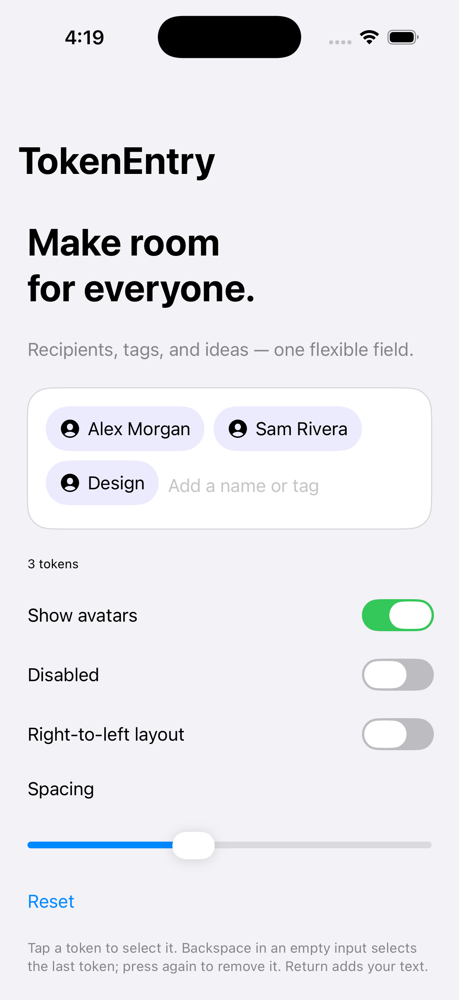

# TokenEntry

**TokenEntry, formerly NWSTokenView.** A SwiftUI-first field for recipients, tags, and other selectable tokens.

Swift 6 · iOS/iPadOS 18+ · Swift Package Manager · MIT · 3.0.0



## Try the playground

```sh
git clone https://github.com/JimmyJammed/token-entry-swift.git
cd token-entry-swift
open TokenEntryDemo.xcodeproj
```

Select TokenEntryDemo and an iPhone or iPad simulator, then Run. Xcode 26.6+ / Swift tools 6.3 is required. No CocoaPods, accounts, or external assets are needed. The checked-in project can optionally be regenerated with `xcodegen generate`.

## Integrate

Add the repository through Xcode Package Dependencies, select the **TokenEntry** product, and import TokenEntry. Pin 3.0.0 when tagged, or a verified commit.

```swift
import SwiftUI
import TokenEntry

struct Tag: Identifiable { let id = UUID(); let name: String }
struct Example: View {
    @State private var tags: [Tag] = []
    @State private var text = ""
    @State private var selection: UUID?
    var body: some View {
        TokenEntryField(tokens: $tags, text: $text, selection: $selection,
            accessibilityLabel: { $0.name },
            onSubmit: { tags.append(Tag(name: $0)) }) { tag, selected in
                Text(tag.name).padding(10)
                    .background(selected ? Color.blue.opacity(0.3) : Color.gray.opacity(0.15), in: Capsule())
        }
    }
}
```

The module's editing logic can be tested on macOS; the field and UIKit adapter are iOS/iPadOS controls.

[Setup](docs/GETTING_STARTED.md) · [API](docs/API.md) · [Customization](docs/CUSTOMIZATION.md) · [Accessibility](docs/ACCESSIBILITY.md) · [Architecture](docs/ARCHITECTURE.md) · [Migration](docs/MIGRATION.md) · [Testing](docs/TESTING.md) · [Validation](docs/VALIDATION.md) · [Troubleshooting](docs/TROUBLESHOOTING.md)

## License

[MIT](LICENSE). Historical attribution is retained. Fictional demo contacts use SF Symbols; no real contact data is accessed.
